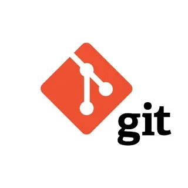

# Работа с Git
## 1. Проверка наличия установленного Git
В терминале выполнить команду "`git version`"
Если Git установлен, появится сообщение с информацией о версии программы, иначе будет сообщение об ошибке.

## 2. Установка Git
Загружаем последнюю версию Git с [сайта](https://git-scm.com/downloads).

## 3. Настрока Git
При первом использовании Git  необходимо представиться. Для этого нужно ввести в терминале две команды:
---
git config --global user.name "Ваше имя"
git config --global user.email "email@example.com".

## 4. Инициализация
Для пользования функциями Git, необходимо пройти инициализацию. Сделать это можно посредством ввода команды "`git init`" в терминале, затем можно проверить правильность настройки с помощью команды "`git version`".

## 5. Версии
Для того, чтобы запись изменений, нужно сначала сохранить файл комбинацией клавиш "`Ctrl + S`" или с помощью меню. Затем добавить изменения при помощи терминала командой "`git add .\название файла`". И зафиксировать изменения командой "`git commit -m 'коментарий к версии'`". Также можно посмотреть разницу между последним сохранением и нынешним состоянием файла командой "`git diff`".

## 6. История сохранений
Чтобы перемещаться между сохранениями используется команда "`git log`", выбирается интересующее сохранение, копируются первые несколько символов кода, затем набирается команда "`git checkout 'символы кода сохранения'`". После просмотра необходимо вернуться к последней версии для продолжения работы с файлом комадой "`git checkout master`".

## 7. Игнорирование файлов
Для того, чтобы Git игнорировал некоторые файлы, такие как картинки, нужно создать дополнительный файл в папке репозитория под названием "`.gitignore`". Чтобы файл игнорировался, его название нужно впиcать в файл "`.gitignore`". После добавления Git не будет требовать коммита вписанного файла.

## 8. Создание веток в Git
Ветка в Git - это простой перемещаемый указатель на один из коммитов, обычно последний в цепочке коммитов.
По умолчанию имя основной ветки в Git - master.
Ветки можно использовать, как черновики, затем сливать их в основную. Таким образом, получится цельный проект.
Создать ветку можно командой:
```
"git branch 'имя новой ветки'"
```
Чтобы при создании ветки сразу на нее переключиться используется команда "```git checkout -b 'имя новой ветки'```"

В результате создается новый указатель на текщий коммит.

Список веток в репозитории можно посмотреть с помощью команды `git branch`.

## 9. Слияние веток и разрешение конфликтов
Для слияния выбранной ветки с текущей нужно выполнить команду: "`git merge 'название выбранной для слияния ветки'`.

Если была измененна одна и та же часть файла в обеих ветках, то может возникнуть конфликт, который потребует участия пользователя. Конфликт можно разрешить путем принятия решения оставить вариант текста основой ветки, сливаемой или принять изменения обеих веток, а затем их можно отредактировать.
После слияния веток, разрешения конфликтов, если они есть, делается коммит для закрепления слияния веток.
## 10. Удаление веток
Чтобы удалить ветку используется команда "`git branch -d 'название ветки'`". При удалении не полностью слитой ветки в основную, данная команда не сработает, нужно будет либо полностью провести слияние, либо воспользоваться другой командой.

Команда "`git branch -D 'название ветки'`" позволяет удалить ветку без полного слияния с основной, при этом нужно быть уверенным, что в этой ветке не осталось важной информации, которая также удалится.

## 11. Работа с удаленными репозиториями
1. Создать аккаунт на GitHub. 
2. Создать локальный репозиторий.
3. Связать удаленный репозиторий с локальным.

Чтобы связать удаленный репозиторий с локальным, нужно ввести ряд команд:
"`git init`" - обычная инициализация репозитория
"`git add README.md`" - принято добавлять такой файл, где описывается то, какая работа производится в этом репозитории.
"`git commit -m 'first commit'`" - первый коммит.
"`git branch -M main`" - делает основной ветку "main".
"`git remote add origin https://github.com/`" - устанавливает путь к удаленному репозиторию.
"`git push -u origin main`" - позволяет отправить ветку main на сервер origin.
Далее производится работа с файлом.
Командой "`git push`" можно загружать изменения файла из локального в удаленный репозиторий.
Командой "`git pull`" можно загружать изменения файла из удаленного репозитория в локальный.